# Гайд по использованию Gitea сервера

Для начала нужно зарегистрироваться в ZTC Id/RDC Auth/SKBKIT Id, для этого нужно написать администратору и отправить свой логин (который хотите), почту и имя фамилию.

Далее администратор сообщит логин и пароль, после чего вы сможете зайти на сайт `https://git.<домен>.ru` и зарегистрироваться там, используя свой логин и почту.

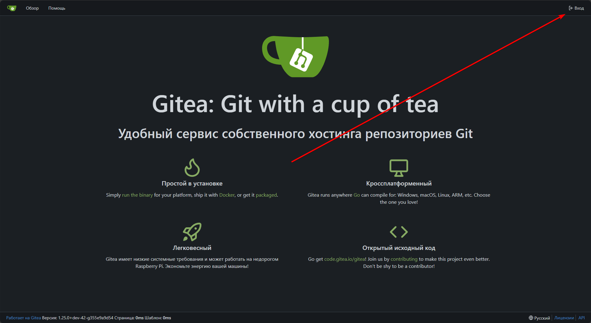

Затем выбираем своего провайдера аутентификации

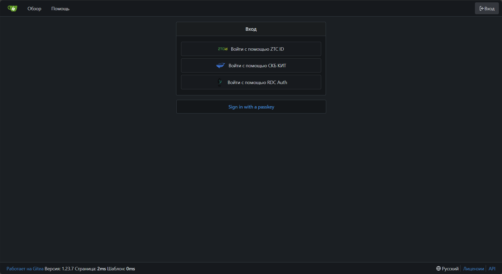

Вводим свой логин и пароль. После чего вам будет предложено сменить пароль на свой. (Пароли хорошо защищены, посмотреть после смены их никто не сможет, только сбросить на новый)

## Настройка клиента

Так как не все Git клиенты поддерживают аутентификацию через SSO, то для работы с ними нужно использовать токены доступа. Это делается для того, чтобы не передавать свой логин и пароль в клиенте, а использовать токен, который можно легко отозвать в случае компрометации.

`Официальный консольный клиент Git на Windows поддерживает аутентификацию через SSO, поэтому для него токены не нужны.` 

Для использования клиентов Git, таких как Github Desktop, GitKraken и других, необходимо использовать токены доступа. Для этого нужно зайти в настройки своего профиля (в правом верхнем углу) и выбрать раздел "Приложения".

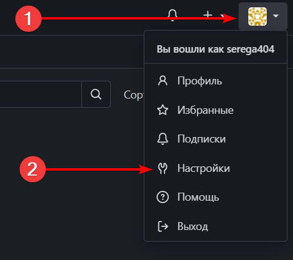

1) Переходим в раздел `Приложения`
2) Вводим название токена (например, "Github desktop")
3) Раскрываем меню `Выбрать разрешения`
4) Выбираем разрешения, которые нужны (для отправки коммитов ставим "`repository`:`Чтение и запись`")
5) Нажимаем `Генерировать токен`

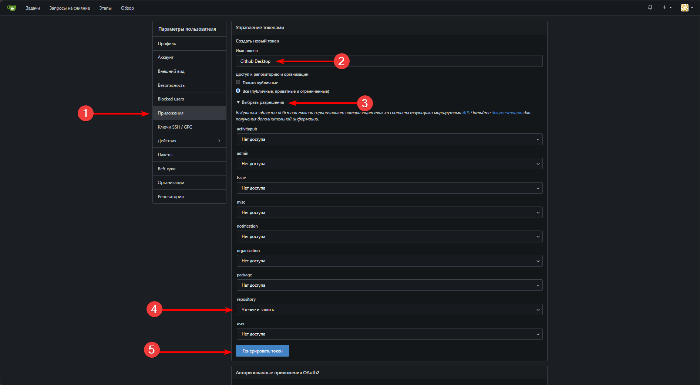

Теперь сохраняем токен в безопасном месте, так как он будет показан только один раз. Если вы его потеряете, то придется создавать новый.

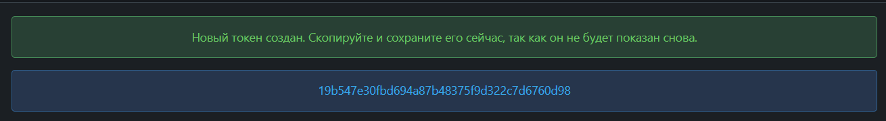

## Пример использования

Для примера будет использовать [GitHub Desktop](https://github.com/apps/desktop) (так как он бесплатный и с открытым кодом), но в других клиентах все аналогично.

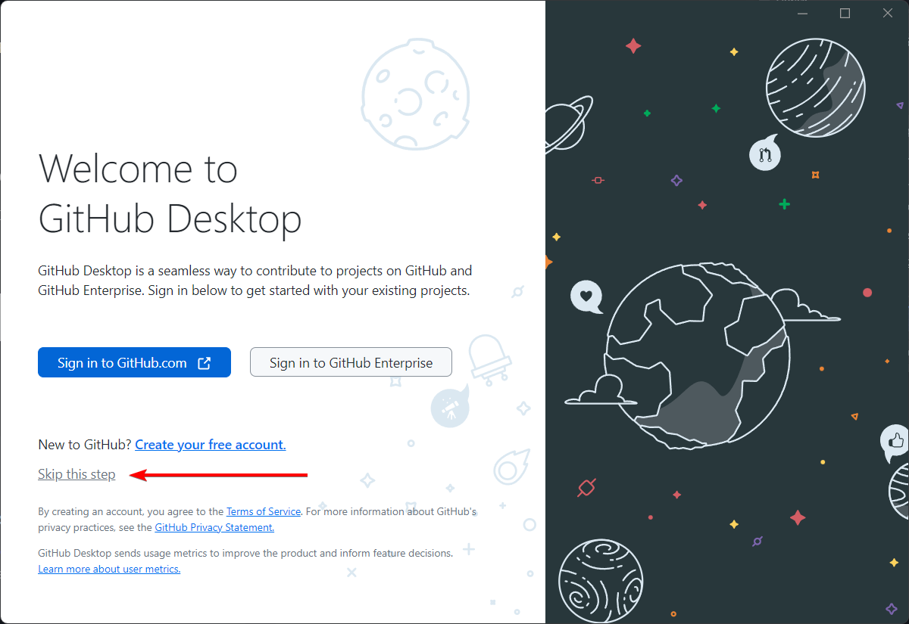

При первом запуске вам будет предложено войти в свой Github аккаунт, этот шаг по желанию можно пропустить.

 

Далее необходимо указать Имя Фамилию и почту для подписи коммитов.

Жмём Finish и видим главный экран приложения, так как скорее всего репозиторий уже существует, нужно клонировать его. Для этого нажимаем `File` -> `Clone repository` или `Ctrl + Shift + O` (или `Cmd + Shift + O` на MacOS).

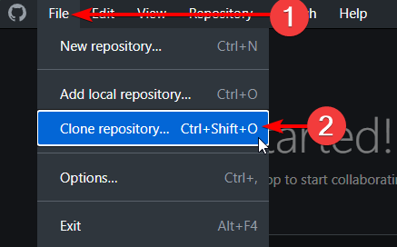

Теперь выбираем вкладку `URL` и вставляем ссылку на репозиторий, который вы хотите клонировать. Ссылка должна выглядеть примерно так: `https://git.<домен>.ru/<владелец>/<ваш репозиторий>`

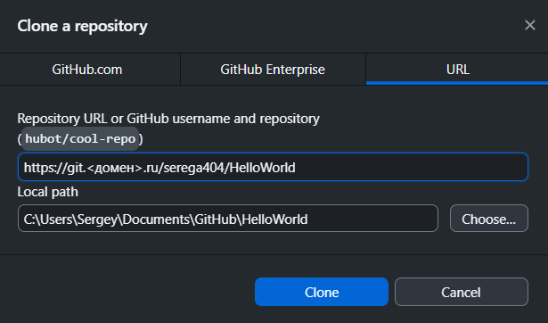

После этого нажимаем `Clone` и вводим свои данные для аутентификации. Логин будет ваш логин, а `пароль = токен`, который вы создали ранее.

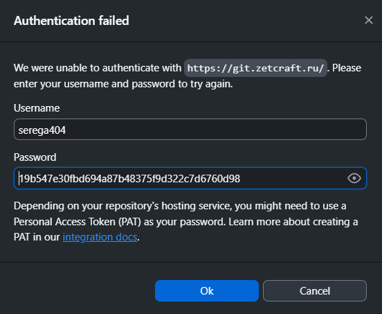

Теперь вы сможете работать с ним как обычно.

Только не забывайте, нажимать кнопку `Fetch origin` что бы не потерять изменения других участников репозитория.

## Миграция репозитория

Для переноса репозитория с другого ресурса в gitea предусмотрены инструменты миграции. Их можно найти в правом верхнем углу при нажатии на кнопку `+` -> `Новая миграция`

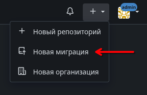

Здесь можно выбрать откуда мигрировать, но на самом деле мигрировать можно с любых ресурсов, поддерживающих git. Для этого нужно выбрать миграцию из `Git`.

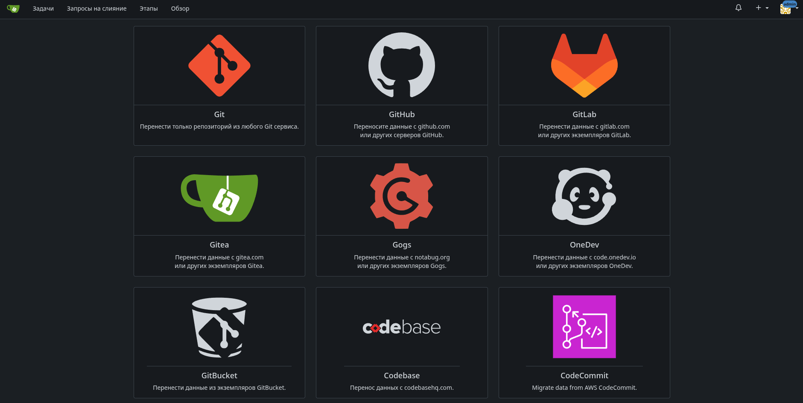 

Далее указываем ссылку на удалённый репозиторий, который нужно перенести. Если репозиторий приватный необходимо ввести данные для аутентификации. (Вместо пароля обычно используются специальные токены)

Галочка `Этот репозиторий будет зеркалом` отвечает за обновление репозитория на gitea при обновлении на удалённом ресурсе. Если галочка стоит, то при каждом пуше на удалённый ресурс, репозиторий на gitea будет обновляться автоматически. Но при этом комитить на gitea не получится.

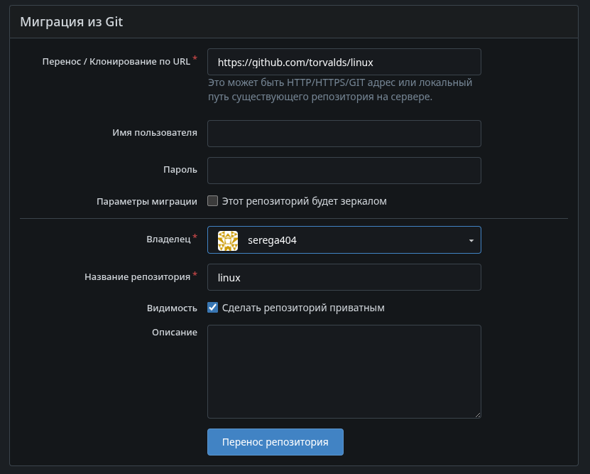

Указываем приватность и название нового репозитория, после чего нажимаем `Перенос репозитория`.

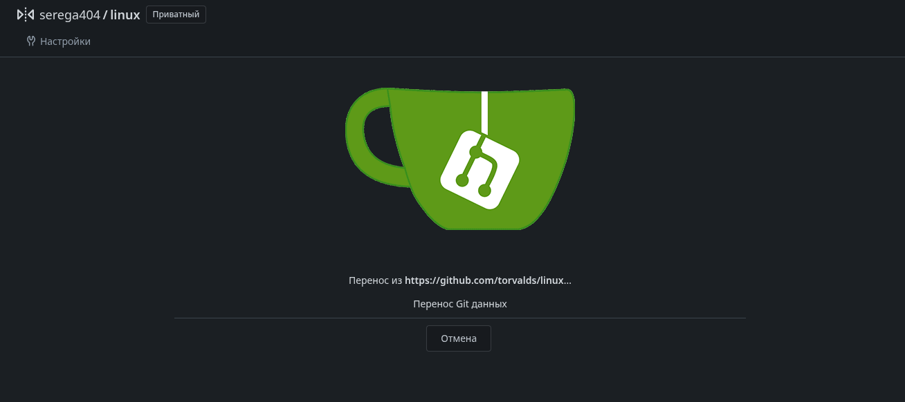 

Ждем завершения миграции... Готово.

